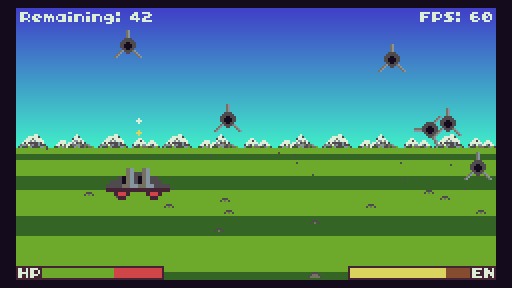

# MainFighter
MainFighter is a shoot-em-up with pseudo-3d graphics, made for the [TIC-80 fantasy console](https://tic80.com/). It was originally made during the [#FC_JAM 2](https://itch.io/jam/fantasy-console-game-jam-2) in 2017.

## Getting the game
You have the following options:

- Get it from [itch.io](https://nalquas.itch.io/mainfighter)
- Get it from [tic80.com](https://tic80.com/play?cart=287)
- Get it from [GitHub](https://github.com/nalquas/mainfighter/releases)

## How to play
In MainFighter, you play a fighter in a planet's atmosphere. Your goal is to defeat all enemy spacecraft to win that bet you made with *Droid X2* yesterday.

## Controls
- Movement: directional keys (normally arrow keys)
- Shoot: TIC-80's "A" button (normally Z on your keyboard)

## How to use development version
If you **don't** have TIC-80 Pro, please download the `.tic` cartridge in the GitHub release tab instead. The normal TIC-80 build can't open `.lua` formatted development cartridges. Alternatively, you should also be able to use a self-compiled version of TIC-80.

Assuming you have TIC-80 Pro installed, you can install the `.lua` dev cartridge like this:

- Run TIC-80 Pro
- Type `folder` to open your TIC-80 directory
- Copy `mainfighter.lua` into the folder
- Type `load mainfighter.lua`, then `run`
